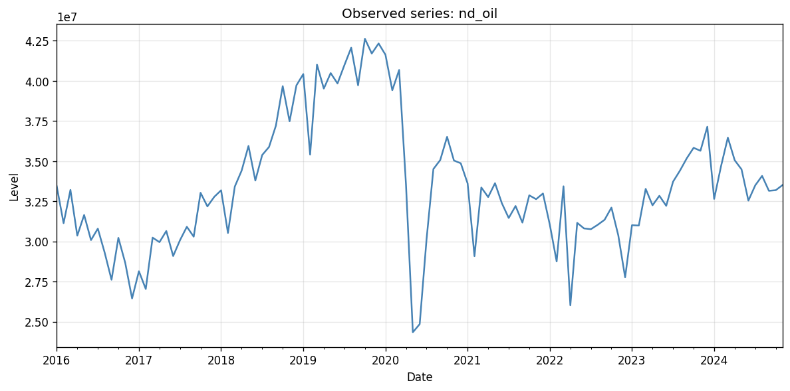
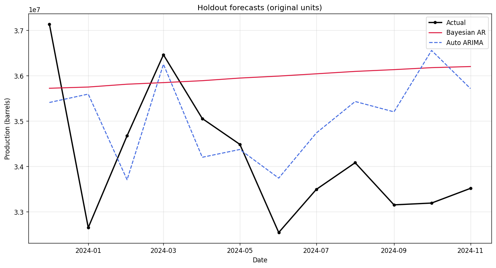

# Bayesian AR for time series analysis in Python

Published: 2024-12-29  
Medium: [Bayesian ARIMA for time series analysis in Python](https://medium.com/@kyle-t-jones/bayesian-arima-for-time-series-analysis-in-python-aabbfe41dcf0)

Companion code for the article. This repo implements **Bayesian AR(p)** with PyMC on a **stationary modeling scale** (e.g. `log_diff`), compared to **auto-SARIMA** and a matching **AR(p) MLE** fit via `pmdarima`. The article title says “ARIMA”; here the Bayesian side is AR on pre-differenced data, while the classical baseline can select seasonal ARIMA.



## Quick start

Requires [uv](https://docs.astral.sh/uv/).

```bash
uv sync
uv run bayesian-arima-run              # full MCMC (4 chains, 1000 draws)
uv run bayesian-arima-run --quick      # demo run (~200 draws)
```

Outputs:

| Path | Contents |
|------|----------|
| `outputs/figures/` | Plots (modeling + **original units**) |
| `outputs/results.json` | Metrics, MCMC diagnostics, interpretation |
| `outputs/trace.nc` | Posterior + posterior predictive (gitignored) |

## Data

Default: **North Dakota monthly oil production** (`data/north_dakota_oil_monthly.csv`). See [data/README.md](data/README.md) and [data/PROVENANCE.md](data/PROVENANCE.md).

```bash
# Other built-ins
uv run bayesian-arima-run --dataset airline_passengers

# Local PPDM well file (not committed)
cp config.local.yaml.example config.local.yaml
uv run bayesian-arima-run --production-path /path/to/north_dakota_production.csv
```

## What gets compared

1. **Bayesian AR(p)** — PyMC `pm.AR`, posterior forecasts with uncertainty.
2. **Fixed AR(p) MLE** — same order as Bayesian AR; validates MCMC against `pmdarima`.
3. **Auto SARIMA** — seasonal search; often wins when seasonality remains after differencing.



## Configuration

`config.yaml` — transforms, holdout size, MCMC (4 chains by default), SARIMA bounds.  
`config.local.yaml` — gitignored machine paths (see example file).

## Development

```bash
uv sync --extra dev
uv run ruff check src tests scripts
uv run pytest                    # fast tests
uv run pytest -m slow            # full MCMC integration
```

CI runs ruff + fast pytest on push.

## Project layout

```
config.yaml
config.local.yaml.example
pyproject.toml / uv.lock
src/bayesian_arima_ts/
scripts/rebuild_monthly.py
tests/
data/
docs/figures/          # example plots for README
article.md
```
